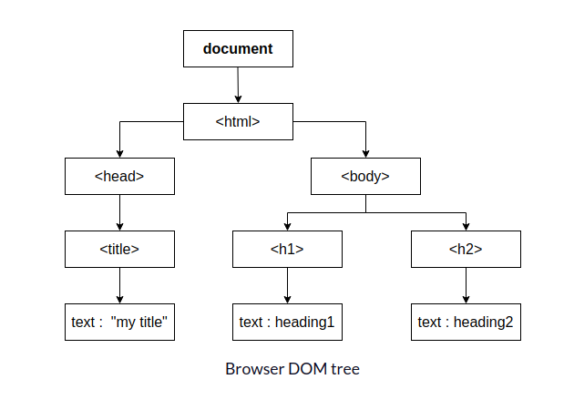

## What is DOM (Document Object Model)?

> - This represents the web page as a tree structure.
> - Any HTML that we code is added as a node, to this tree.

 

## document

> - Any tree must have a root node and this is the `document`.
> - `document` is part of the browser. Any `HTML` tag you write is going to be a direct or indirect child of the root node document.

